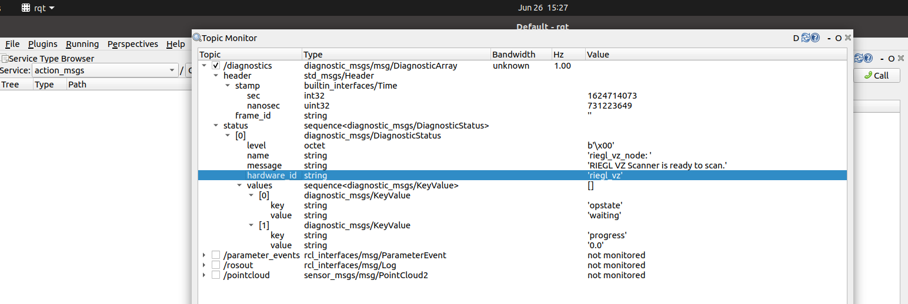

# ROS2 RIEGL-VZ Package

This package is based on ROS2 [Galactic Geochelone](https://docs.ros.org/en/galactic/index.html) distribution and has been tested on Ubuntu Desktop 20.04 (Focal Fossa).

**ROS2 installation and setup:**

Follow ROS2 installation instructions on https://docs.ros.org/en/galactic/Installation/Ubuntu-Development-Setup.html.

Configure the ROS2 environment according to https://docs.ros.org/en/galactic/Tutorials/Configuring-ROS2-Environment.html.

Create a new workspace (https://docs.ros.org/en/galactic/Tutorials/Workspace/Creating-A-Workspace.html)
and clone repository into subdirectory 'src'.

**Install diagnostics updater package:**

```sudo apt-get install ros-galactic-diagnostic-updater```

**Install tf2 packages:**

```sudo apt-get install ros-galactic-tf2-tools ros-galactic-tf-transformations```

**Install python requirements:**

Switch to 'src' subdirectory and install required python modules:

```python3 -m pip install -r requirements.txt```

**Install librdb python wheel:**

Request a python wheel for librdb from RIEGL support: support@riegl.com  
The wheel includes a shared linux library which must be appropriate for the target processor architecture.  
Install the wheel, e.g. x86_64:

```pip3 install riegl.rdb-2.3.4-cp34.cp35.cp36.cp37.cp38.cp39-none-linux_x86_64.whl```

**Build package:**

Switch to workspace root directory.

```colcon build```

**Start 'riegl_vz' node:**

Open a second terminal. Execute '. install/setup.bash'.

Find .yaml files for configuration of node parameters in package install directory at: **install/riegl_vz/share/riegl_vz/config/**.

Copy **params_default.yaml** to **params.yaml** end edit parameter settings.

Launch 'riegl_vz' node with parameter settings from params.yaml:

```ros2 launch riegl_vz std_launch.py```

**Trigger a scan data acquisition:**

Open another terminal. Execute '. install/setup.bash'.

Execute the scan trigger service:

```ros2 service call /scan std_srvs/srv/Trigger```

**Visualize scan data point cloud with rviz:**

Start 'rviz' tool:

```rviz2```

Set 'fixed-frame' in 'Global Options' to 'riegl_vz_socs'. Activate 'PointCloud2' plugin and bind it to riegl_vz/pointcloud topic:


**Monitor diagnostics with rqt:**

Start 'rqt' tool, activate 'Topic Monitor' plugin and select '/diagnostics' topic for monitoring:

```rqt```


