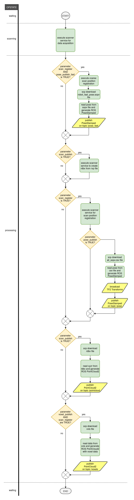

# ROS2 RIEGL VZ Package API

## 1. Coordinate Systems

**SOCS** (Scanner's Own Coordinate System):  

Angle data and range data are the base for calculation of the data in the Scanner’s Own Coordinate System (SOCS).


**PRCS** (Project Coordinate System):  

A number of scan positions and the data acquired therein make up a scan project. The center of the project’s coordinate system (PRCS) coincides horizontally with the center of the first scan position. The axes of PRCS are strictly pointing to east (x-axis, red), north (y-axis, green) and up (z-axis, blue), respectively.

The SOP transforms SOCS into PRCS.


**GLCS** (Global Coordinate System):

A global coordinate system like WGS84.

The POP transforms GLCS into PRCS

**VOCS** (Voxel Coordinate System):  

Automatic registration does not estimate the SOP with every new scan position, but the SOPV pose, which does not transform to PRCS, but to another cartesian coordinate system, the so called VOCS (Voxel Coordinate System). A once determined SOPV pose stays unchanged. What changes is the VOP. The VOP pose is determined via compensation of a fixed block of registered scan positions against all further measurements. Further measurements are the scanners inclination, northing from internal magnitude sensor, which is fraught with great uncertainty, and GNSS position if available.  

After first scan: VOP = eye(4)  
After each consecutive scan: VOP <> eye(4)  

If the user is only interested in relative registration of scan positions to each other, the VOP and the POP can be ignored.


## 2. RIEGL Interfaces

### 2.1 Messages

**riegl_vz_interfaces/ScanPose**:
```
uint32 seq   # Scan position number within a project
geometry_msgs/PoseStamped pose
```
'seq' is the scan position number.  
See PoseStamped definition: [geometry_msgs/PoseStamped](https://github.com/ros2/common_interfaces/blob/master/geometry_msgs/msg/PoseStamped.msg)

**riegl_vz_interfaces/Voxels**:
```
float32 voxel_size
sensor_msgs/PointCloud2 pointcloud
```
The 'frame_id' in the pointcloud.header is 'riegl_vz_vocs'.  
See PointCloud2 definition: [sensor_msgs/PointCloud2](https://github.com/ros2/common_interfaces/blob/master/sensor_msgs/msg/PointCloud2.msg)

**riegl_vz_interfaces/TiePoint**:
```
std_msgs/Header header
uint32 seq                      # scan position number within a project, starting with 1, 0 is the current scan position
geometry_msgs/Point position    # position of the reflector
geometry_msgs/Vector3 normal    # normal vector to the reflector surface
float32 diameter                # calculated reflector diameter in meter
string model_name               # reflector model name
string name                     # reflector name
uint32 point_count              # number of measurements
float32 reflectance             # reflectance of the reflector in dB
```
The 'frame_id' in the header is 'riegl_vz_socs'.
'seq' is the scan position number.

### 2.2 Services

**riegl_vz_interfaces/GetScanPoses**:
```
---
string project                # Scan project name
ScanPose[] scanposes
geometry_msgs/PoseStamped vop # position and orientation of VOCS in PRCS
geometry_msgs/PoseStamped pop # position and orientation of PRCS in GLCS
bool success                  # indicate successful run of service
string message                # informational, e.g. for error messages
```   
The 'frame_id' in the scanposes[n].header is 'riegl_vz_vocs'.  
The 'frame_id' in the vop.header is 'riegl_vz_prcs'.  
The 'frame_id' in the pop.header is the name of the global coordinate system, which is e.g. EPSG::4978.

**riegl_vz_interfaces/GetTpl**:
```
---
uint32 seq                    # scan position number within a project, 0 is the current scan position
---
TiePoint[] tpl                # the tie point list
bool success                  # indicate successful run of service
string message                # informational, e.g. for error messages
```  

**riegl_vz_interfaces/SetPosition**:
```
geometry_msgs/PointStamped position
float64[3] covariance   # covariances of X, Y, Z axis
---
bool success   # indicate successful run of service
string message # informational, e.g. for error messages
```
See PointStamped definition: [geometry_msgs/PoseStamped](https://github.com/ros2/common_interfaces/blob/master/geometry_msgs/msg/PointStamped.msg)
The 'frame_id' in the header is either  
... the name of a global coordinate system, which is e.g. EPSG::4978. If its not WGS84 it must be supported by the GeoSys manager in the scanner.
... 'riegl_vz_prcs' the scanner project coordinate system. If string is empty 'riegl_vz_prcs' is assumed.  
... another coordinate system with an available tf2 transformation to 'riegl_vz_prcs'.  

**riegl_vz_interfaces/SetPose**:
```
geometry_msgs/PoseWithCovarianceStamped pose
---
bool success   # indicate successful run of service
string message # informational, e.g. for error messages
```
See PoseWithCovarianceStamped definition: [geometry_msgs/PoseWithCovarianceStamped](https://github.com/ros2/common_interfaces/blob/master/geometry_msgs/msg/PoseWithCovarianceStamped.msg)
The 'frame_id' in the header is either  
... a coordinate system with an available tf2 transformation to 'riegl_vz_prcs'.
... 'riegl_vz_prcs' the scanner project coordinate system. If string is empty 'riegl_vz_prcs' is assumed.    

## 3. Nodes

### 3.1 riegl_vz

#### 3.1.1 Parameters

**~hostname** (string, default: "") :

The scanners hostname or IP address.

**~working_dir** (string, default: "/tmp/ros_riegl_vz") :

The root working directory for runtime execution.

**~ssh_user** (string, default: "user") :

The linux user name for SSH login on the scanner.

**~ssh_password** (string, default: "user") :

The linux user password for SSH login on the scanner.

**~project_name** (string, default: "") :

The name of the project to be loaded or created.

**~storage_media** (integer, default: 0) :

The active storage media for scan data recording (0: INTERNAL SSD, 1: USB, 2: SD CARD).

**~scan_pattern** (double[], default: {30.0,130.0,0.04,0.0,360.0,0.04})

Specifies the field of view (FOV) for scanning and the scan increments.  
[0]: Line Start Angle  
[1]: Line Stop Angle  
[2]: Line Angle Increment  
[3]: Frame Start Angle  
[4]: Frame Stop Angle  
[5]: Frame Angle Increment  

**~scan_pattern_name** (string, default: "")

Name of a factory or user defined scan pattern, which is for example 'Overview' or 'Panorama_40'.  
If pattern is available and not empty, this overwrites the configuration values from '~scan_pattern'.

**~meas_program** (integer, default: 3)

This is the laser scanner measurement program, which specifies the laser scanner frequency.

**~scan_publish** (bool, default: "True") :

Enable publishing of point cloud data on topic 'pointcloud' after scan acquisition has finished.

**~scan_publish_filter** (string, default: "") :

Filter string for published point cloud data, e.g. "(riegl.xyz[2] > 5) && (riegl.reflectance > 35)"

**~scan_publish_lod** (integer, default: 0) :

Level of detail (LOD) for published point cloud. This is to reduce the number of measurements.     
lod=0 : no reduction  
lod=1 : reduce measurements by factor 2 (2^1)  
lod=2 : reduce point cloud by factor 4 (2^2)  
lod=3 : reduce point cloud by factor 8 (2^3)  
...  

**~scan_register** (bool, default: "True") :

Enable automatic scan position registration in current project after scan data acquisition has finished.

**~scan_registration_mode** (integer, default: 1) :

Supported values for scan registration mode are:  
    1 ... AUTO  
    2 ... OUTDOOR_URBAN  
    3 ... OUTDOOR_NON_URBAN  
    4 ... INDOOR_SMALL  
    5 ... INDOOR_LARGE  
    6 ... MINING_MEDIUM  
    7 ... MINING_LARGE  

**~pose_publish** (bool, default: "True") :

Enable publishing of scan registration result on topic 'pose' after scan registration has finished.

**~voxel_publish** (bool, default: "True") :

Enable publishing of voxel data on topic 'voxels' after scan acquisition has finished.

**~reflector_search** (bool, default: "False") :

Enable automatic reflector search with every scan data acquisition.

**~reflector_search_models** (string, default: "") :

Name of reflector search model. Can be specified multiple times, separated by comma (e.g. "RIEGL flat reflector 50 mm, RIEGL flat reflector 100 mm")

**~reflector_search_limits** (double[], default: {0.0, 10000.0}) :

Minimum and maximum range in meter between scan-position and reflector.

**~control_points_csv_file** (string, default: "") :

Path to CSV with control points in GLCS (Global Coordinate System).

**~control_points_coord_system** (string, default: "") :

The coordinate system for control points (e.g. EPSG::4978).

**~image_capture** (integer, default: 0) :

Configures capturing of images with external camera mounted on top of RIEGL Vz laser scanner. (0=disabled, 1=enabled, 2=automatic)

**~image_capture_mode** (integer, default: 1) :

The image capture mode (1=during-scan, 2=after-scan).

**~image_capture_overlap** (integer, default: 25) :

The image overlap factor in percent.

**~set_pose_topic** (string, default: "") :

The name of a topic providing the roboter position and orientation. The message format must be 'geometry_msgs/PoseWithCovarianceStamped' with queue size of 10. The node automatically subscribes to this topic at startup. This is an alternative to the 'set_pose' service call.

**~relative_pose_mode** (bool, default: "False") :

If enabled the driver calculates relative position and orientation changes from one scan position to the next with pose from the 'set_pose' service or topic, otherwise it uses the absolute positions and orientations (see documentation for 'set_pose').

**~robot_scanner_mounting_pose** (double[], default: {0.0, 0.0, 0.0, 0.0, 0.0, 0.0})

The mounting position and orientation (x, y, z, roll, pitch, yaw) of the scanner on a roboter, with coordinates in meter and euler angles in radians. This is used for the 'set_pose' service or topic if 'relative_pose_mode' parameter is disabled.

**~robot_project_frame_id** (string, default: "") :

The frame id of the robot project coordinate system. This is used for the 'set_pose' service or topic if 'relative_pose_mode' parameter is disabled. Note that this must be the frame id of the pose from the 'set_pose' service or topic.

**~robot_scanner_project_pose** (double[], default: {0.0, 0.0, 0.0, 0.0, 0.0, 0.0})

The position and orientation (x, y, z, roll, pitch, yaw) of the origin of the scanner project CS (riegl_vz_prcs) in the roboter project coordinate system, with coordinates in meter and euler angles in radians. This is used for the 'set_pose' service or topic if 'relative_pose_mode' parameter is disabled. A static TF2 transformation will be broadcasted automatically at startup if 'robot_project_frame_id' is configured as well.

#### 3.1.2 Published Topics

**pointcloud** ([sensor_msgs/PointCloud2](https://github.com/ros2/common_interfaces/blob/master/sensor_msgs/msg/PointCloud2.msg)) :

Point cloud with scan data from the laser scanner.Data will be published only if parameter '~scan_publish' is enabled. The pointcloud data includes following data fields:  

```
float32 x, y, z               : Cartesian point coordinates in 'riegl_vz_socs' coordinate system
float32 r                     : Target point reflectance in dB
```

**voxels** (riegl_vz_interfaces/Voxels) :

Voxel data for current scan position. Data will be published only if parameter '~scan_register' and '~voxel_publish' are enabled. The pointcloud data includes following data fields:  

```
float64 x, y, z               : Cartesian point coordinates in 'riegl_vz_vocs' coordinate system
float32 r                     : Target surface reflectance in dB
uint32 point_count            : Number of points this point represents (e.g. points combined to voxels or plane patches, 0 = unknown)
float32[3] pca_axis_min       : The eigenvector that belongs to the smallest eigenvalue (result of PCA, 0: X, 1: Y, 2: Z)
float32[3] pca_axis_max       : The eigenvector that belongs to the greatest eigenvalue (result of PCA, 0: X, 1: Y, 2: Z)
float32[3] pca_extents        : Volume extents along 0: pca_axis_max, 1: pca_axis_min x pca_axis_max, 2: pca_axis_min
uint8 shape_id                : Estimated shape of point cloud (0 = undefined, 1 = plane, 2 = line, 3 = volume)
```

**pose** ([geometry_msgs/PoseStamped](https://github.com/ros2/common_interfaces/blob/master/geometry_msgs/msg/PoseStamped.msg)):

Topic provides SOPV (Scan Position and Orientation in VOCS) of the currently registered scan position.

**gnss** ([sensor_msgs/NavSatFix.msg](https://github.com/ros2/common_interfaces/blob/master/sensor_msgs/msg/NavSatFix.msg)) :

Actual GNSS fix with position in WGS84 coordinates (EPSG::4979). If the gnss receiver provides coordinates in another coordinate system, they are automatically transformed to WGS84 by means of the GeoSys service in the scanner. If coordinate transformation fails because the required database in '/media/internal/gsm.gsfx' is missing or does not contain the required information, the coordinates will be set to 0 each.

**diagnostics** ([diagnostic_msgs/DiagnosticArray.msg](https://github.com/ros2/common_interfaces/blob/master/diagnostic_msgs/msg/DiagnosticArray.msg)):

Riegl VZ status information, published once per second:

```
scanner:
  opstate       : operating state ("unavailable", "waiting", "scanning", "processing")
  active_task   : active task description
  progress      : scan progress in percent
  scan_position : number of current scan position
  laser         : laser state 'on' or 'off'
errors:
  warn_num      : number or pending system warnings
  err_num       : number of pending system
memory:
  mem_free_gb   : free storage media memory space in GByte
  mem_usage     : storage media memory usage in percent of total space
gnss:
  gnss_fix      : GNSS fix
  gnss_num_sat  : number of available satellites
camera:
  cam_detect    : external camera detected
```

#### 3.1.3 Services

**set_project** ([std_srvs/Trigger](https://github.com/ros2/common_interfaces/blob/master/std_srvs/srv/Trigger.srv)) :

Load an existing project on the scanner with name from parameter '~project_name'. If the project name is empty or the project can not be loaded, a new project will be created automatically.

Response:  
success = True -> message: Project Name  

**scan** ([std_srvs/Trigger](https://github.com/ros2/common_interfaces/blob/master/std_srvs/srv/Trigger.srv)) :

Start a background task for laser scan data acquisition.

The execution state will be published in 'opstate' field of 'diagnostics' topic.  
The node is locked until all background tasks have finished and the operating state is 'waiting' again.

If parameter '\~scan_publish' is enabled, acquired data will be published on 'pointcloud' topic soon after scanning has finished.

The parameter '\~scan_register' enables automatic scan position registration after scanning. The registration result is published on topic 'pose' and with TF2 broadcast messages (see 3.1.4).

The parameter '\~reflector_search' activates automatic search and scan of reflector targets.

The parameter '\~image_capture' enables automatic capturing of images with an external camera mounted on top of the laser scanner device.

Response:  
success = True -> message: "success"  
success = False -> message: "device not available" | "device is busy" | "command execution error"



**set_position** (riegl_vz_interfaces/SetPosition) :

Set position of the scanner origin. The position must be set before the scan has finished. This is used for scan registration without GNSS. Scanner orientation still comes from the scanner internal IMU and magnetic field sensor.

**set_pose** (riegl_vz_interfaces/SetPose) :

Set position and orientation from a robot with accurate kinematic sensors for example. The position and orientation must be set before the scan has finished. The behavior of the service call depends on the parameter 'relative_pose_mode'.  

relative_pose_mode = True: The driver calculates relative position and orientation changes from one scan position to the next. The resulting data is used for scanner position determination of the scan registration algorithm.  

relative_pose_mode = False: The driver uses the absolute positions and only the yaw angle from the orientation for scanner position determination of the scan registration algorithm.  


For absolute pose from a robot the driver needs:
- The scanner mounting position and orientation on the robot, which is the transformation from roboter body CS (robot_body_cs) to VZ scanner SOCS (robot_vz_socs). This has to be configured with parameter 'robot_scanner_mounting_pose'.  
- A TF2 transformation available for coordinate transformation from roboter to scanner project CS (robot_proj_cs -> riegl_vz_prcs). It is expected that 'set_pose' service call provides absolute positions and orientations in the roboter project CS.

**get_scan_poses** (riegl_vz_interfaces/GetScanPoses) :

Request all positions and orientations of previously registered scans of the current project.

Response:  
success = True -> message: "success", project: Project Name, scanposes: All Scan Poses, vop: VOP Pose, pop: POP Pose  
success = False -> message: "device not available" | "command execution error"

**get_tpl** (riegl_vz_interfaces/GetTpl) :

Get a list of tie points (reflectors) of a previous scan position of the current project with configuration parameter '~reflector_search' activated.

Response:  
success = True -> message: "success", tpl: List of Tie Points  
success = False -> message: "device not available" | "command execution error"

**stop** ([std_srvs/Trigger](https://github.com/ros2/common_interfaces/blob/master/std_srvs/srv/Trigger.srv)) :

Stop laser scan data acquisition and registration background tasks.

Response:  
success = True -> message: "success"  
success = False -> message: "device not available" | "command execution error"

**shutdown** ([std_srvs/Trigger](https://github.com/ros2/common_interfaces/blob/master/std_srvs/srv/Trigger.srv)) :

Stop data acquisition and power down the laser scanner device.

Response:  
success = True -> message: "success"  
success = False -> message: "command execution error"

#### 3.1.4 TF2 Transformation

The node will broadcast TF2 transformation messages if an existing project is loaded and after each scan position registration:


